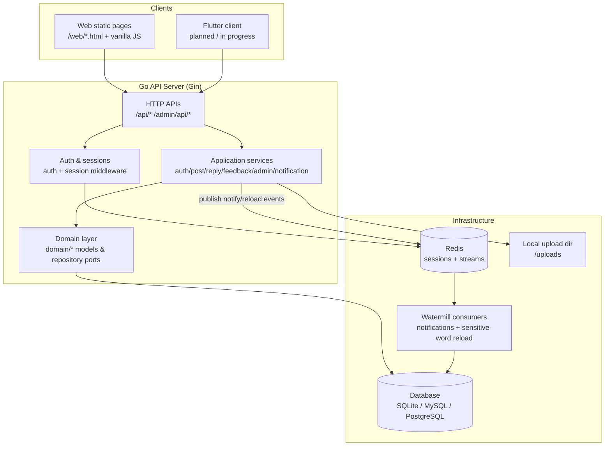

# Blink

English | [中文](README.zh-CN.md)

Blink is a lightweight microblog backend: registration and login, post feeds, threaded replies, image uploads, in-app notifications, user feedback, and an admin console (static HTML). The server is written in Go with DDD-style layering; HTTP contracts are maintained in OpenAPI.

## Features

- **Authentication & sessions**
  - Email/password registration: `POST /auth/register` (optional email verification via `POST /auth/register/send_code`)
  - Email/password login: `POST /auth/login`; password change / reset via verification codes
  - OAuth2 authorization-code login: third-party (e.g. Google) or built-in IdP (`builtin`)
  - Session cookie: `blink_session` (sessions stored in Redis)
- **Social content**
  - Categories: `GET /api/categories` (built-in categories are seeded on startup when empty)
  - Feeds: `GET /api/posts`, `GET /api/posts/{id}`, `GET /api/me/posts`
  - Replies / nested comments: `GET /api/posts/{id}/replies`, create reply (login required)
  - Image upload: `POST /api/uploads` (multipart field `file`); files default to `data/uploads`, served at `/uploads/...`
- **In-app notifications (async)**
  - Watermill + Redis Stream: publish events after successful operations; consumers persist rows in `notifications` (can be split into a dedicated worker later)
- **Feedback**
  - Logged-in users submit feedback and may follow up; admins reply in the console; both sides get in-app notification reminders
- **Moderation & admin**
  - Sensitive words: block publish/reply on hit; admin CRUD broadcasts reload via Redis Stream
  - Admin JSON API: `/admin/api/*` (`users.role` is `admin` or `super_admin`; see OpenAPI)
  - Categories CRUD, audit logs, feedback management, SMTP/settings
  - Static pages: `/web/*.html` (vanilla JS, no React)
- **Conventions**
  - Snowflake IDs are serialized as **strings** in JSON to avoid JavaScript precision loss

## Quick start (local)

You need **Go** and **Redis** (default `127.0.0.1:6379`). From the repo root:

```bash
mkdir -p data
go run ./cmd
```

Verify with health checks:

```bash
curl -sS http://127.0.0.1:11110/healthz
curl -sS http://127.0.0.1:11110/health
```

## Architecture



## Configuration (environment variables)

Common variables (all have defaults):

- **`BLINK_HTTP_ADDR`**: listen address (default `:11110`)
- **`BLINK_DATABASE_DSN`**: database DSN (default SQLite at `./data/blink.db`)
- **`BLINK_REDIS_ADDR`**: Redis address (default `127.0.0.1:6379`)
- **`BLINK_MIGRATIONS_DIR`**: migrations directory (default `platform/db`)
- **`BLINK_UPLOAD_DIR`**: upload directory (default `data/uploads`)
- **`BLINK_BOOTSTRAP_SUPER_ADMIN_EMAIL`**: promote the user with this email to `super_admin` on startup (idempotent)

The built-in IdP (`builtin`) is enabled only when **both** are set (otherwise those routes are not mounted; `POST /auth/register` still works):

- **`BLINK_PUBLIC_BASE_URL`**: public base URL, e.g. `http://localhost:11110` (no trailing `/`)
- **`BLINK_OAUTH_CLIENT_SECRET`**: first-party client secret (use a strong random value in production)

See `docs/` for a fuller list.

## Database migrations

Default SQLite migration:

```bash
go run ./cmd/migrate
```

The migrate CLI also supports `postgres` / `mysql`. See:

- `platform/db/SCHEMA.md`
- `cmd/migrate/README.md`

## Docs & API contract

- **Local run & health checks**: `docs/run-local.md`
- **Architecture (DDD layers, HTTP vs notification pipeline)**: `docs/architecture.md`
- **Login, registration & OAuth**: `docs/auth-login-registration.md`
- **Email verification & SMTP**: `docs/email-auth.md`
- **Feeds & admin console**: `docs/social-feed-and-admin.md`
- **In-app notifications (Watermill + Redis Stream)**: `docs/watermill-notifications.md`
- **HTTP curl examples**: `docs/http-curl-examples.md`
- **OpenAPI**: `api/openapi/openapi.yaml`
  - After changing OpenAPI and regenerating code: `docs/oapi-codegen.md` (updates `api/gen/apigen.gen.go`)

## Repository layout (overview)

- `cmd/`: entrypoints (API server, migrate, …)
- `domain/`: domain models, repository interfaces, domain events
- `application/`: use-case services (post/admin/auth/notification/…)
- `infrastructure/`: HTTP (Gin), GORM persistence, Redis/Watermill, OAuth adapters
- `platform/db/`: SQL migrations
- `web/`: static HTML (user pages & admin assets)

## Roadmap

- **Flutter client** (implementation and docs will grow in-repo)
  - Plan: `docs/flutter-client-plan.md`
