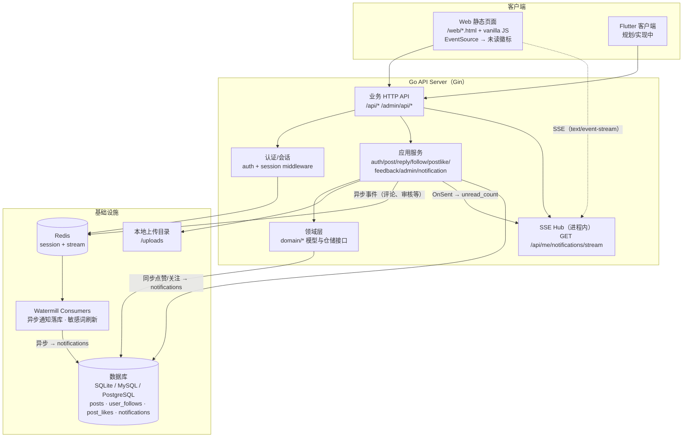

# Blink

[English](README.md) | 中文

Blink 是一个轻量的微博/动态（microblog）后端项目：提供注册/登录、帖子流、评论、图片上传、站内通知、意见反馈，以及管理后台（静态 HTML）。后端采用 Go，并按 DDD 分层组织代码，接口契约以 OpenAPI 维护。

## 功能

- **认证与会话**
  - 邮箱密码注册：`POST /auth/register`（可配合 `POST /auth/register/send_code` 做邮箱验证）
  - 邮箱密码登录：`POST /auth/login`；登录态改密 / 找回密码（验证码）
  - OAuth2 授权码登录：第三方（如 Google）或自建 IdP（`builtin`）
  - 会话 Cookie：`blink_session`（Redis 存储会话）
- **社交内容**
  - 分类：`GET /api/categories`（启动时空表会写入内置分类）
  - 帖子流：`GET /api/posts`、`GET /api/posts/{id}`、`GET /api/me/posts`
  - 评论/楼中楼：`GET /api/posts/{id}/replies`、发布评论（需登录）
  - 关注用户：`POST/DELETE /api/users/{id}/follow`，统计 `GET /api/users/{id}/follow-stats`
  - 帖子点赞：`POST/DELETE /api/posts/{id}/like`；列表/详情含 `like_count`，登录时还含 `liked`
  - 图片上传：`POST /api/uploads`（multipart 字段 `file`），默认存储到 `data/uploads`，通过 `/uploads/...` 访问
- **站内通知**
  - 点赞/关注：成功后**同步**写入 `notifications`（见 `docs/notifications-message-body.md`）
  - 评论、审核、申诉等：**异步**经 Watermill + Redis Stream → 消费者落库
  - **SSE 推送**：`GET /api/me/notifications/stream` — Web 导航通过 `EventSource` 订阅，有新消息时显示未读徽标
- **意见反馈**
  - 登录用户提交反馈并可补充，管理员在后台回复，双方通过站内消息收到提醒
- **内容治理与后台**
  - 敏感词：命中则拒绝发布/评论；后台 CRUD 后通过 Redis Stream 广播刷新
  - 管理 JSON API：`/admin/api/*`（`users.role` 为 `admin` 或 `super_admin`，详见 OpenAPI）
  - 分类 CRUD、审计日志、反馈管理、SMTP/后台设置
  - 排名统计：今日/本月/本年发帖排名与用户活跃排名（`GET /admin/api/rankings`）
  - 静态页面：`/web/*.html`（无 React 等框架，保持简单）
- **工程约定**
  - Snowflake ID 在 JSON 中统一用**字符串**传输，避免 JS 精度问题

## 快速开始（本地运行）

需要 **Go** 和 **Redis**（默认 `127.0.0.1:6379`）。在仓库根目录执行：

```bash
mkdir -p data
go run ./cmd
```

启动后可用健康检查确认：

```bash
curl -sS http://127.0.0.1:11110/healthz
curl -sS http://127.0.0.1:11110/health
```

## 架构图



**通知三条路径：** (1) **同步** — 点赞/关注（及意见反馈）由 HTTP 直接调用 `notification.Service` 写 `notifications` 表。(2) **异步** — 评论、审核等经 Watermill 落库。(3) **SSE** — 任意通知写入后，`OnSent` 向进程内 Hub 推送；已连接的浏览器更新导航未读徽标，无需轮询。

## 配置（环境变量）

常用环境变量（均有默认值，可按需覆盖）：

- **`BLINK_HTTP_ADDR`**：监听地址（默认 `:11110`）
- **`BLINK_DATABASE_DSN`**：数据库 DSN（默认 SQLite，文件在 `./data/blink.db`）
- **`BLINK_REDIS_ADDR`**：Redis 地址（默认 `127.0.0.1:6379`）
- **`BLINK_MIGRATIONS_DIR`**：迁移目录（默认 `platform/db`）
- **`BLINK_UPLOAD_DIR`**：上传目录（默认 `data/uploads`）
- **`BLINK_BOOTSTRAP_SUPER_ADMIN_EMAIL`**：启动时将指定邮箱用户提升为 `super_admin`（幂等）

自建 IdP（`builtin`）只在同时配置以下变量时启用（未配置时相关路由不挂载，不影响 `POST /auth/register`）：

- **`BLINK_PUBLIC_BASE_URL`**：对外基址，如 `http://localhost:11110`（无尾部 `/`）
- **`BLINK_OAUTH_CLIENT_SECRET`**：第一方客户端密钥（生产请用强随机）

更完整列表与解释见 `docs/`。

## 数据库迁移

默认 SQLite 迁移：

```bash
go run ./cmd/migrate
```

该迁移 CLI 也支持 `postgres` / `mysql`，详见：

- `platform/db/SCHEMA.md`
- `cmd/migrate/README.md`

## 文档与接口契约

- **本地运行与健康检查**：`docs/run-local.md`
- **架构（DDD 分层、HTTP vs 通知流）**：`docs/architecture.md`
- **登录/注册与 OAuth 流程**：`docs/auth-login-registration.md`
- **邮箱验证与 SMTP**：`docs/email-auth.md`
- **帖子流与管理后台**：`docs/social-feed-and-admin.md`
- **通知消息体（生成与查询）**：`docs/notifications-message-body.md`
- **站内通知（Watermill + Redis Stream）**：`docs/watermill-notifications.md`
- **HTTP curl 示例**：`docs/http-curl-examples.md`
- **OpenAPI**：`api/openapi/openapi.yaml`
  - 若修改了 OpenAPI，并需要重新生成代码：见 `docs/oapi-codegen.md`（会生成/更新 `api/gen/apigen.gen.go`）

## 目录结构（速览）

- `cmd/`：入口（API Server、migrate 等）
- `domain/`：领域模型、仓储接口、领域事件
- `application/`：用例服务（post/admin/auth/notification/...）
- `infrastructure/`：HTTP（Gin）、GORM 持久化、Redis/Watermill、OAuth 适配
- `platform/db/`：SQL migrations
- `web/`：静态 HTML（管理/页面资源）

## Roadmap（实现中）

- 前端计划：Flutter 客户端（仓库内会逐步补齐对应实现与文档）
  - 规划文档：`docs/flutter-client-plan.md`
