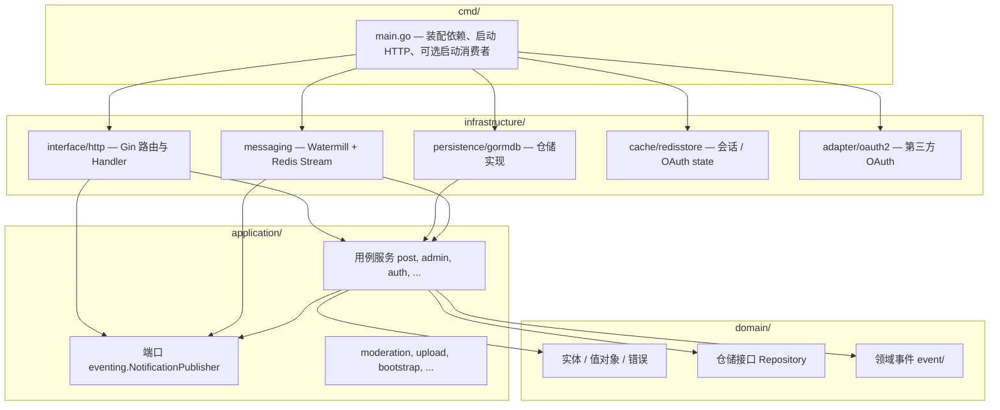
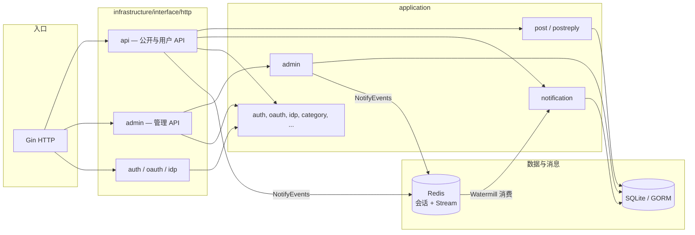
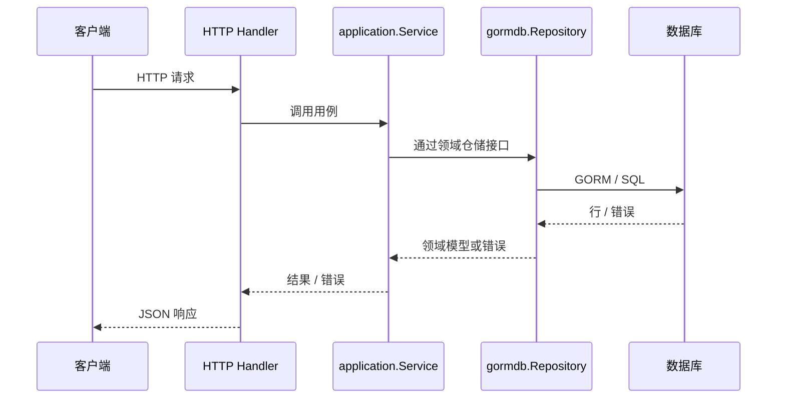
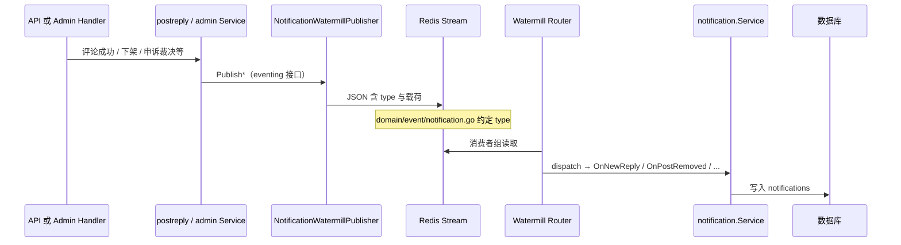

# Blink 后端架构说明与图示

本文用分层视图、依赖关系、同步请求与异步通知三条线描述当前实现，便于 onboarding 与演进时对照。细则仍以 [`.cursor/rules/01-architecture.md`](../.cursor/rules/01-architecture.md) 为准。

---

## 1. DDD 分层与依赖方向

只允许依赖由外向内指向领域核心：`cmd` → `infrastructure` → `application` → `domain`。领域层不依赖外层。

说明：`NotificationPublisher`（`A2`）定义在 `application/eventing`，**实现**在 `I3`（`NotificationWatermillPublisher`）。`cmd/main.go` 在装配时把 `I3` 注入到需要 `A2` 的服务（如 API Server、`admin.Service`）；应用代码只依赖接口，不 `import` Watermill。

---

## 2. 进程内主要模块关系（简化）

---

## 3. 同步请求路径（示例：读帖、发帖）

典型路径：**客户端 → Gin Handler → application.Service → domain 仓储接口 → gormdb 实现 → 数据库**。Handler 不写领域规则，只做协议映射与错误码。

---

## 4. 异步路径：站内通知（领域事件出站）

业务成功后由应用层调用 `NotificationPublisher`；消息进入 **Redis Stream**，由同进程（或独立 worker）内 **Watermill Router** 消费，再调用 `application/notification.Service` 写入 `notifications` 表。协议与运维细节见 [watermill-notifications.md](./watermill-notifications.md)。

---

## 5. 目录与职责速查

| 路径 | 职责 |
|------|------|
| `cmd/main.go` | 打开 DB/Redis、迁移、装配仓储与服务、注册路由、启动 Watermill 消费者（可禁用） |
| `domain/` | 帖子、用户、评论、通知等领域模型；**仓储接口**；`event/` 事件名与载荷约定 |
| `application/` | 用例编排；`eventing/` 异步出站端口 |
| `infrastructure/persistence/gormdb` | 仓储实现、事务运行器 |
| `infrastructure/interface/http` | Gin：`api`、`admin`、`auth`、`oauth`、`idp` |
| `infrastructure/messaging` | 通知 Stream 名、Watermill Publisher/Subscriber/Router |
| `infrastructure/cache/redisstore` | Session、OAuth state |
| `api/gen` | OpenAPI 生成类型（若使用 codegen 流程） |
| `web/` | 静态 HTML 等前端资源 |
| `platform/db/` | SQL 迁移 |

---

## 6. 演进时对照

- 新增**同步**能力：先定领域与仓储接口，再实现 gormdb，最后接 HTTP。
- 新增**通知类**异步能力：扩展 `domain/event`、`NotificationPublisher`、Watermill 发布/消费与 [watermill-notifications.md](./watermill-notifications.md) 中的协议表。
- 若引入独立通知 worker：主进程可只保留 Publisher，消费者进程跑同一套 `Subscriber` + Router（见 Watermill 文档中的环境变量说明）。
