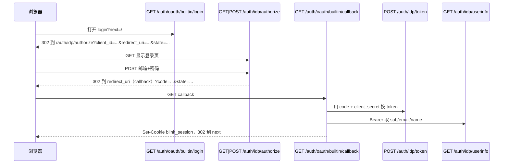

# 登录与注册（OAuth2）

本文说明 Blink 的认证方式：**OAuth2 授权码流程**；提供方可为 **第三方（如 Google）** 或 **本服务内置的 OAuth2 授权服务器（自建 IdP，`builtin`）**，无需依赖外部账号体系即可登录。

实现入口：`cmd/main.go`；OAuth 客户端编排：`application/oauth`；自建 IdP：`application/idp`、`infrastructure/interface/http/idp`；邮箱密码注册：`application/auth`。

---

## 两种模式对比

| 模式 | 说明 |
|------|------|
| **第三方 IdP** | 例如 `google`：用户在 Google 登录，本服务用 code 换 token 再拉 userinfo。 |
| **自建 IdP（`builtin`）** | 本进程提供 `/auth/idp/*`（authorize / token / userinfo），浏览器在 **本服务页面** 输入邮箱与密码；仍通过标准 OAuth2 回调到 `/auth/oauth/builtin/callback`，与第三方路径一致。 |

启用 **自建 IdP**（`/auth/idp/*` 与 OAuth 提供方 **`builtin`**）需同时配置 `BLINK_PUBLIC_BASE_URL` 与 `BLINK_OAUTH_CLIENT_SECRET`（见下文）。未配置时这些路由不挂载；**`POST /auth/register` 始终可用**，用于先注册本地账号，待 IdP 启用后再走 `builtin` 登录。

---

## 概念：OAuth「注册」与「登录」

对任意提供方 `provider`（`google` / `builtin` 等）：

- **首次**在某 `provider` 下出现新的 `(provider, provider_subject)` 时：写入 `users` 与 `oauth_identities`（即「注册」）。
- **再次**同一绑定成功时：只更新登录信息并签发会话（即「登录」）。

**邮箱密码注册**（`POST /auth/register`）会创建 `users` 行，并写入 `oauth_identities`（`provider=builtin`，`provider_subject` 为用户 snowflake 的十进制字符串），以便随后走 `builtin` OAuth 时 `CompleteLogin` 能关联到同一用户。

---

## HTTP 路由（OAuth 客户端）

挂载在 **`/auth/oauth`**：

| 方法 | 路径 | 说明 |
|------|------|------|
| GET | `/auth/oauth/{provider}/login` | 生成 `state`、写入 Redis，302 到 IdP 授权页 |
| GET | `/auth/oauth/{provider}/callback` | 校验 `state`、用 `code` 换 token、拉 userinfo、写 Redis 会话、设置 Cookie |

### 查询参数

- **`login`**：`next`（可选）  
  成功后的重定向地址，**仅允许站内相对路径**（以 `/` 开头且非 `//`），否则为 `/`。

- **`callback`**：`code`、`state`（IdP 回调携带）

### 会话 Cookie

- **名称**：`blink_session`  
- **属性**：`HttpOnly`、`SameSite=Lax`、`Path=/`  
- 生产环境建议 HTTPS 下再开启 `Secure`。

---

## 自建 IdP（不依赖第三方）

当环境变量满足 **`BLINK_PUBLIC_BASE_URL` 非空** 且 **`BLINK_OAUTH_CLIENT_SECRET` 非空** 时：

1. 注册 **`builtin`** OAuth 客户端：`AuthURL` / `TokenURL` / `UserInfoURL` 均指向本服务的 `/auth/idp/*`。  
2. 挂载 **授权服务器**：
   - `GET|POST /auth/idp/authorize`：授权页（GET 为登录表单，POST 提交邮箱、密码后签发 `code` 并重定向回 `redirect_uri`）。  
   - `POST /auth/idp/token`：用 `authorization_code` 换 `access_token`。  
   - `GET /auth/idp/userinfo`：`Bearer` 访问，返回 `sub` / `email` / `name`（与现有 `oauthadapter.Provider` 解析逻辑兼容）。  
3. **`POST /auth/register`** 在进程内**始终挂载**（不依赖本节环境变量）；本节启用 IdP 后，用户可先注册再完成 `builtin` 授权码登录。IdP 启用时与注册共用同一套用户与 `oauth_identities` 存储。

### 推荐流程（完全自建）

1. `POST /auth/register` 注册。  
2. 浏览器打开：`{BLINK_PUBLIC_BASE_URL}/auth/oauth/builtin/login?next=/`  
3. 经 `/auth/idp/authorize` 输入邮箱密码 → 回调 `/auth/oauth/builtin/callback` → 设置 `blink_session`。

`BLINK_PUBLIC_BASE_URL` 必须与浏览器访问本服务使用的 **协议 + 主机 + 端口** 一致（例如 `http://localhost:11110`），否则服务端用 `oauth2.Config` 回调自身 `TokenURL` / `UserInfoURL` 会失败。

### `/auth/idp/authorize` 怎么用？

它是 OAuth2 里的 **授权端点**（Authorization Endpoint），面向 **浏览器**，不是给前端直接 `fetch` 一个 JSON 用的。

**GET**（查询参数必填）：

| 参数 | 含义 |
|------|------|
| `client_id` | 与 `BLINK_OAUTH_CLIENT_ID` 一致（默认 `blink`） |
| `redirect_uri` | 登录成功后浏览器要被带去哪里；**必须与 IdP 白名单完全一致**（默认即下面的「回调」地址） |
| `response_type` | 固定 `code`（授权码模式） |
| `state` | 随机串，防 CSRF；从 **`/auth/oauth/builtin/login` 进入时由 Blink 生成并写入 Redis**，IdP 会在最后原样拼回 `redirect_uri` |

响应：**200**，`text/html`，内含邮箱、密码表单（POST 仍发到 `/auth/idp/authorize`）。

**POST**（`application/x-www-form-urlencoded`）：除上述四个参数以隐藏域带上外，还有 `email`、`password`。校验通过后，响应 **302**，`Location` 为：

`{redirect_uri}?code={授权码}&state={原 state}`

授权码短时有效，只能由 **持有 client_secret 的一方**（此处是 Blink 自己的后端）到 **`POST /auth/idp/token`** 换成 `access_token`。

日常自建登录 **不必手写** authorize 的 URL：打开  
`{BLINK_PUBLIC_BASE_URL}/auth/oauth/builtin/login?next=/`  
即可由 Blink 拼好参数并 302 到 authorize。

### 「回调」`/auth/oauth/builtin/callback` 是干什么的？

先分清两个角色：

| 角色 | 路径前缀 | 谁在用 |
|------|-----------|--------|
| **授权服务器（自建 IdP）** | `/auth/idp/*` | 浏览器访问 authorize 登录页；后端用 token / userinfo |
| **OAuth 客户端（Blink 应用）** | `/auth/oauth/*` | Blink 把 **自己** 当成「接入 IdP 的应用」，完成会话 |

**回调地址**是注册在 IdP 里的 **`redirect_uri`**（默认 `BLINK_OAUTH_REDIRECT_URL` 或 `{PUBLIC_BASE}/auth/oauth/builtin/callback`）。含义是：

1. 用户在 **authorize** 页面输入密码成功后，**浏览器**被重定向到这个 URL，并带上 **`code` + `state`**（出现在地址栏查询串里）。  
2. Blink 后端在处理 **`GET /auth/oauth/builtin/callback`** 时：校验 `state`、用 `code` 调 **`POST /auth/idp/token`**、再调 **`GET /auth/idp/userinfo`**，最后写入 **Redis 会话** 并 **`Set-Cookie: blink_session`**，再按之前 `login?next=` 里保存的目标 **302** 回站内页。

所以：**authorize = 在 IdP 侧「证明你是谁」；callback = 在应用侧「用授权码办完手续、签发本站登录态」**。没有这一步，浏览器只有 IdP 发的 `code`，还没有 Blink 的登录 Cookie。



---

## 数据存储

### 数据库

- **`users`**：含邮箱、展示名、`password_hash`（bcrypt）等。仅通过第三方 OAuth 创建的用户使用随机占位密码，不能用于 IdP 密码登录。  
- **`oauth_identities`**：`platform/db/0004_oauth_identities.sql`，`(provider, provider_subject)` 唯一。

应用层通过 [GORM](https://gorm.io/) 访问上述表，说明见 [`docs/database-gorm.md`](database-gorm.md)。

### Redis

| 用途 | Key 前缀 | 说明 |
|------|-----------|------|
| OAuth CSRF state | `blink:oauth:state:{state}` | 短 TTL，回调 **GETDEL** 消费 |
| 应用会话 | `blink:session:{token}` | 登录会话 JSON |
| IdP 授权码 | `blink:idp:code:{code}` | 自建 IdP，一次性 |
| IdP access token | `blink:idp:access:{token}` | 自建 IdP，换 userinfo |

---

## 环境变量

### 通用

| 变量 | 默认 | 说明 |
|------|------|------|
| `BLINK_HTTP_ADDR` | `:11110` | 监听地址 |
| `BLINK_DATABASE_DSN` | `file:./data/blink.db?...` | SQLite |
| `BLINK_REDIS_ADDR` | `127.0.0.1:6379` | Redis |
| `BLINK_MIGRATIONS_DIR` | `platform/db` | 迁移目录（建议在模块根目录运行） |
| `BLINK_SNOWFLAKE_NODE` | `1` | Snowflake 节点 0–1023 |

### 自建 IdP + `builtin` 客户端（同时设置才启用）

| 变量 | 说明 |
|------|------|
| `BLINK_PUBLIC_BASE_URL` | 对外基址，**无尾部斜杠**，如 `http://localhost:11110` |
| `BLINK_OAUTH_CLIENT_SECRET` | 第一方客户端密钥（请在生产中设为强随机） |
| `BLINK_OAUTH_CLIENT_ID` | 默认 `blink` |
| `BLINK_OAUTH_REDIRECT_URL` | 默认 `{BLINK_PUBLIC_BASE_URL}/auth/oauth/builtin/callback`，须与授权请求中的 `redirect_uri` 完全一致（IdP 白名单） |

### Google（可选，三者齐全才启用 `google`）

| 变量 | 说明 |
|------|------|
| `OAUTH_GOOGLE_CLIENT_ID` | Google 客户端 ID |
| `OAUTH_GOOGLE_CLIENT_SECRET` | 客户端密钥 |
| `OAUTH_GOOGLE_REDIRECT_URL` | 须与 Google 控制台「已授权重定向 URI」一致 |

---

## 端到端流程（示意）

```mermaid
sequenceDiagram
  participant B as 浏览器
  participant A as Blink
  participant R as Redis
  participant I as IdP（Google 或 /auth/idp）
  participant D as 数据库

  B->>A: GET /auth/oauth/{provider}/login?next=/foo
  A->>R: 保存 oauth state
  A->>B: 302 Location = IdP 授权 URL（含 state）
  B->>I: 用户登录（或自建页输入密码）
  I->>B: 302 redirect_uri?code=&state=
  B->>A: GET /auth/oauth/{provider}/callback?code=&state=
  A->>R: 校验并删除 state
  A->>I: code 换 access_token
  A->>I: 拉取 userinfo
  alt 首次 (provider, subject)
    A->>D: INSERT users + oauth_identities
  else 已存在
    A->>D: 读用户，更新 last_login
  end
  A->>R: 写入 blink_session 数据
  A->>B: Set-Cookie blink_session; 302 next
```

---

## 错误与安全

- 未知 `provider`、无效 `state`、账号非活跃等会返回 4xx；回调错误不暴露内部细节。  
- 自建 IdP 的 `redirect_uri` 必须在服务端白名单内（当前为配置的 `BLINK_OAUTH_REDIRECT_URL`）。  
- `BLINK_OAUTH_CLIENT_SECRET` 勿提交到仓库。

---

## 相关代码路径

| 层级 | 路径 |
|------|------|
| OAuth 登录用例 | `application/oauth/login.go` |
| 邮箱注册 | `application/auth/register.go` |
| 自建 IdP 用例 | `application/idp/service.go` |
| IdP / 注册 HTTP | `infrastructure/interface/http/idp`、`infrastructure/interface/http/auth` |
| Redis | `infrastructure/cache/redisstore` |
| GORM 仓储 | `infrastructure/persistence/gormdb` |
