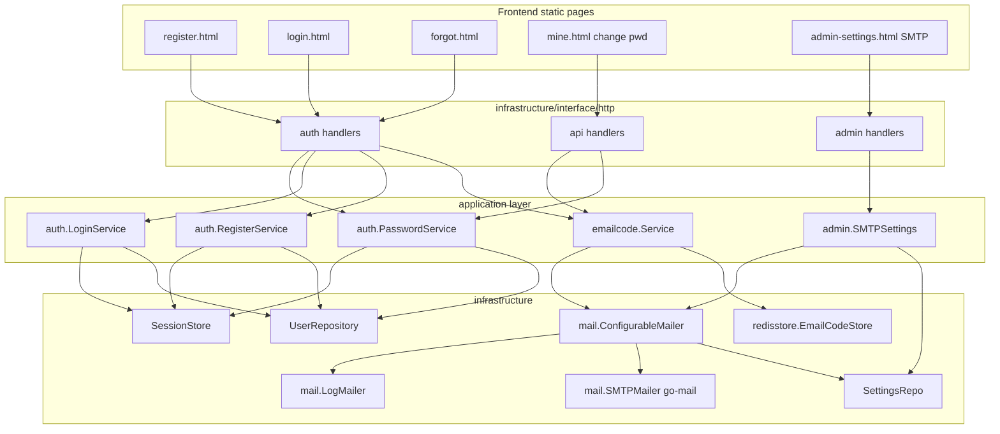
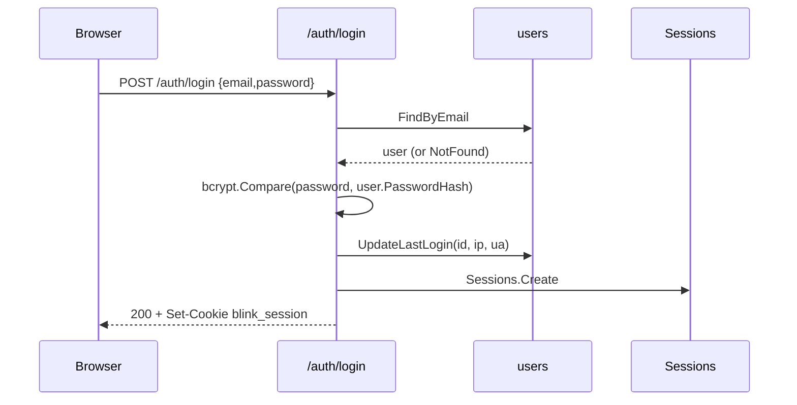
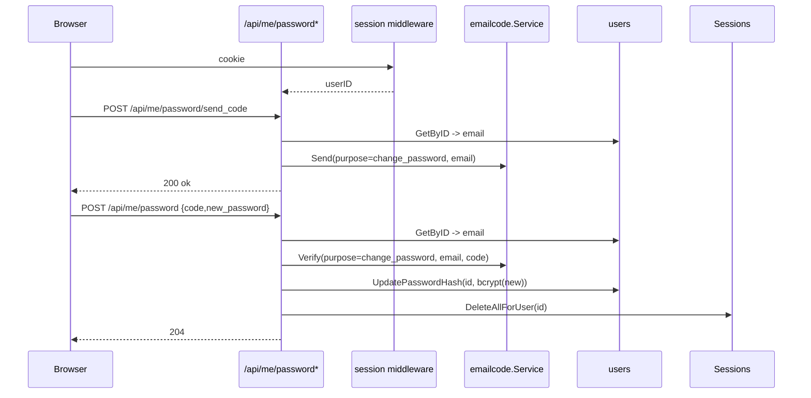
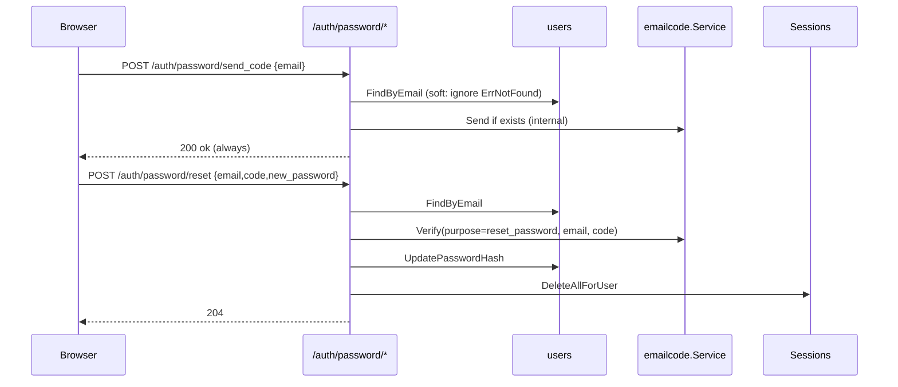

# 邮箱注册 / 登录 / 改密 模块设计（Email Auth）

本文档描述基于邮箱验证码的注册、登录、修改密码、找回密码四条路径，以及管理员可在后台动态配置的 SMTP 邮件发送能力。

与 OAuth 登录的关系：与 [auth-login-registration.md](auth-login-registration.md) 互补。邮箱密码路径直接颁发 `blink_session`；OAuth 路径照旧。两条路径共用 `users` 表与 `oauth_identities(builtin)` 绑定，实现"注册一次，两种登录方式均可"。

---

## 1. 背景与目标

现状（截至本次改造前）：

- `POST /auth/register` 立即建号，**无邮箱校验**。
- 没有邮箱 + 密码直接登录的接口，登录依赖 OAuth（Google）或内置 IdP 的 `/auth/idp/authorize` 表单。
- 没有修改密码 / 找回密码的自助路径，仅超管可 `reset_password`。
- 无邮件能力。

目标：

1. 注册前必须通过邮箱验证码（防止无效邮箱/恶意注册）。
2. 新增 `POST /auth/login` 邮箱 + 密码登录。
3. 已登录用户修改密码时，向当前邮箱发码确认。
4. 未登录用户可通过邮箱验证码找回（重置）密码。
5. SMTP 配置 **不走 env**，超管在后台页面即改即生效；未配置时自动降级为日志输出（本地联调不卡壳）。

---

## 2. 功能列表

| # | 功能 | 鉴权 | 入口 |
|---|------|------|------|
| F1 | 发送注册验证码 | 无 | `POST /auth/register/send_code` |
| F2 | 邮箱 + 密码注册（验证码校验） | 无 | `POST /auth/register` |
| F3 | 邮箱 + 密码登录 | 无 | `POST /auth/login` |
| F4 | 登录态修改密码 - 发码 | 会话 | `POST /api/me/password/send_code` |
| F5 | 登录态修改密码 - 提交 | 会话 | `POST /api/me/password` |
| F6 | 找回密码 - 发码 | 无 | `POST /auth/password/send_code` |
| F7 | 找回密码 - 重置 | 无 | `POST /auth/password/reset` |
| F8 | 读 SMTP 配置 | super_admin | `GET /admin/api/settings/smtp` |
| F9 | 写 SMTP 配置 | super_admin | `PUT /admin/api/settings/smtp` |
| F10 | 发测试邮件 | super_admin | `POST /admin/api/settings/smtp/test` |

---

## 3. 架构总览



分层原则沿用现有 DDD 结构：

- `domain/` 只放接口和纯领域类型；
- `application/` 编排用例；
- `infrastructure/` 做具体适配（Redis / SMTP / GORM / HTTP）；
- `interface/http/` 做薄转换层；
- `cmd/main.go` 手工注入，与现有风格一致。

---

## 4. 领域与数据模型

### 4.1 领域接口（新增）

`domain/mail/mailer.go`：

```go
package mail

import "context"

type Message struct {
    To       string
    Subject  string
    TextBody string
    HTMLBody string
}

type Mailer interface {
    Send(ctx context.Context, msg Message) error
}
```

### 4.2 数据库

- **不新增表**。
- 验证码、限流计数、失败计数全部放 Redis（TTL 自管理）。
- SMTP 配置复用现有 `app_settings` 键值表（见 [platform/db/0008_app_settings.sql](../platform/db/0008_app_settings.sql)）。

### 4.3 `app_settings` 键清单

| key | 值示例 | 说明 |
|---|---|---|
| `smtp.enabled` | `true` / `false` | 关闭时全部邮件走 LogMailer |
| `smtp.host` | `smtp.qq.com` | |
| `smtp.port` | `465` / `587` / `25` | |
| `smtp.username` | `noreply@example.com` | |
| `smtp.password` | `********` | 明文存储（与其它 `app_settings` 记录同级），不回显给前端 |
| `smtp.from` | `noreply@example.com` | |
| `smtp.from_name` | `Blink` | 同时用作验证码邮件的"产品名"（主题与正文） |
| `smtp.security` | `starttls` / `ssl` / `plain` | |
| `smtp.version` | 单调自增整数 | 写入时 `+=1`，mailer 用它检测缓存失效 |

---

## 5. 验证码服务

### 5.1 责任

- 生成 6 位数字验证码（`crypto/rand`，避开前导 0 -> 固定 6 位字符串化）。
- 存 Redis（TTL 10 分钟，**一次性**）。
- 按 `purpose` 隔离，防止一码多用。
- 限流（发送侧 + 校验失败侧）。
- 实际发送委托 `Mailer`。

### 5.2 Purpose 枚举

```go
const (
    PurposeRegister       = "register"
    PurposeChangePassword = "change_password"
    PurposeResetPassword  = "reset_password"
)
```

### 5.3 Redis Key 布局

| key | 值 | TTL |
|---|---|---|
| `email_code:{purpose}:{email}` | 6 位明文码 | 10 min |
| `email_code_rl:{purpose}:{email}` | 计数（INCR） | 1 hour（滑动窗口简化成固定窗口） |
| `email_code_cool:{purpose}:{email}` | `1` | 60 sec（重发冷却） |
| `email_code_fail:{purpose}:{email}` | 计数（INCR） | 与 code 同 TTL |
| `email_code_iprl:{purpose}:{ip_or_uid}` | 计数 | 1 hour |

### 5.4 规则

- 冷却：上次发送后 60 秒内再发 → `ErrCoolingDown`。
- 上限：单邮箱每小时最多 5 封；单 IP / 用户 ID 每小时最多 20 封。
- 校验失败：`email_code_fail` ≥ 5 时删除 code 并返回 `ErrInvalidCode`。
- 校验成功：`DEL email_code:... email_code_fail:...`。
- `email_code_rl` 与 `email_code_cool` 不因发送失败而写入（保证能重试）。

### 5.5 伪代码

```go
func (s *Service) Send(ctx, purpose, email, ipKey) error {
    email = normalize(email)
    if cooling(purpose, email) { return ErrCoolingDown }
    if over(hourlyEmail, purpose, email) { return ErrTooMany }
    if over(hourlyIP, purpose, ipKey)   { return ErrTooMany }

    code := random6()
    body := render(purpose, code)
    if err := mailer.Send(ctx, Message{To:email, ...body}); err != nil {
        return err
    }
    SET email_code:{purpose}:{email}      code     EX 600
    SET email_code_cool:{purpose}:{email} 1        EX 60
    INCR email_code_rl:{purpose}:{email}  (EX 3600 on first)
    INCR email_code_iprl:{purpose}:{ipKey}(EX 3600 on first)
    return nil
}

func (s *Service) Verify(ctx, purpose, email, code) error {
    stored := GET email_code:{purpose}:{email}
    if stored == "" { return ErrInvalidCode }
    if ct_eq(stored, code) == false {
        if INCR email_code_fail:... >= 5 { DEL code }
        return ErrInvalidCode
    }
    DEL code, fail
    return nil
}
```

---

## 6. 邮件发送

### 6.1 选型

使用 **[github.com/wneessen/go-mail](https://github.com/wneessen/go-mail)**。

理由：

- 纯 Go、零第三方依赖，与项目整体风格一致。
- 同时支持 STARTTLS / SSL-on-connect / Plain，TLS 配置与 `smtp.security` 一一对应。
- 认证方式齐全（LOGIN / PLAIN / CRAM-MD5 / XOAUTH2），兼容腾讯企业邮、阿里云、163、Gmail、SendGrid SMTP 等。
- API 简洁、活跃维护、测试友好。

对标准库 `net/smtp` 的劣势：不支持 LOGIN 认证（很多国内 SMTP 必须 LOGIN），且需自行拼装 MIME。

### 6.2 实现结构

```
infrastructure/mail/
  smtp.go           // SMTPMailer，封装 go-mail
  log.go            // LogMailer：日志降级
  configurable.go   // ConfigurableMailer：从 settings 读配置 + 缓存 + 降级
```

### 6.3 ConfigurableMailer 缓存与热生效

- 每次 `Send` 读取 `smtp.version`；若与缓存的版本号一致，复用上次构造的 `SMTPMailer`；否则重读全部配置、构造新 client。
- `smtp.enabled=false` 或 `smtp.host` 为空 → 本次请求走 `LogMailer`。
- 失败不 panic，返回错误由上层决定是否降级。

### 6.4 SMTP 密码存储

- 模块**不引入任何 env**；SMTP 配置全部落在 `app_settings`，通过超管后台页面读写。
- `smtp.password` 以**明文**保存，与其它后台可改配置同级；API `GET /admin/api/settings/smtp` 永远把密码字段置空（仅返回 `has_password`）。
- 由于密码落在 DB，其保护等同于对数据库本身的保护。生产部署中对 DB 启用磁盘加密 / 文件系统加密 / DB 级加密即可覆盖这一层；若未来需要"信封加密（KMS/HSM）"，以新增字段 + 迁移的方式引入，不与后台配置目标冲突。

---

## 7. 接口契约

### 7.1 注册 - 发码

```
POST /auth/register/send_code
Content-Type: application/json
{ "email": "alice@example.com" }
```

响应：始终 `200 OK {"ok":true}`，即使邮箱已被注册（反枚举）；内部不发送给已注册邮箱。

错误：`429 Too Many Requests` 限流；`400 Bad Request` 邮箱格式错误。

### 7.2 注册

```
POST /auth/register
{
  "email": "alice@example.com",
  "password": "xxxxxxxx",
  "name": "alice",
  "code": "123456"
}
```

响应（与现状一致）：`201 Created`，Set-Cookie `blink_session`，body `{user_id, session_token, session_cookie}`。

错误：`400 invalid email / password too short / invalid or expired code`、`409 email already registered`。

### 7.3 登录

```
POST /auth/login
{ "email": "alice@example.com", "password": "xxxxxxxx" }
```

响应：`200 OK`，Set-Cookie `blink_session`，body `{user_id, session_token, session_cookie}`。

错误：`401 invalid credentials`（邮箱不存在 / 密码错 / 已禁用 统一返回同一文案）、`429`。

### 7.4 修改密码（登录态）

```
POST /api/me/password/send_code        (requires blink_session)
POST /api/me/password                   (requires blink_session)
{ "code": "123456", "new_password": "xxxxxxxx" }
```

响应：成功 `204 No Content`；成功后 **所有该用户会话失效**（`Sessions.DeleteAllForUser`），前端应清 cookie 并跳转登录页。

错误：`400 invalid code / password too short`、`429`。

### 7.5 找回密码

```
POST /auth/password/send_code  { "email": "alice@example.com" }
POST /auth/password/reset      { "email": "...", "code": "123456", "new_password": "xxxxxxxx" }
```

响应：`send_code` 永远 `200 OK`（反枚举）；`reset` 成功 `204 No Content`，同步清该用户所有会话。

错误：`400 invalid code / password too short`、`429`。

### 7.6 管理员 SMTP

```
GET  /admin/api/settings/smtp
PUT  /admin/api/settings/smtp
  {
    "enabled": true, "host": "smtp.qq.com", "port": 465,
    "username": "noreply@x.com", "password": "", "from": "noreply@x.com",
    "from_name": "Blink", "security": "ssl"
  }
POST /admin/api/settings/smtp/test { "to": "me@x.com" }
```

- `GET` 返回的 `password` 恒为空字符串；前端判断 `has_password: true/false` 显示占位。
- `PUT` 中 `password == ""` 表示不修改；非空则覆盖。
- 任何一次写入都会 `INCR smtp.version`，让 mailer 下次 `Send` 立刻看到新配置。

---

## 8. 时序图

### 8.1 注册

```mermaid
sequenceDiagram
    participant UI as Browser
    participant API as /auth/register*
    participant EC as emailcode.Service
    participant M as Mailer
    participant R as Redis
    participant U as users (GORM)
    participant S as Sessions (Redis)

    UI->>API: POST /auth/register/send_code {email}
    API->>EC: Send(purpose=register, email)
    EC->>R: check cooling / rate limit
    EC->>M: Send(verification email)
    M-->>EC: ok
    EC->>R: SET code EX 600; SET cool EX 60; INCR rl
    API-->>UI: 200 ok

    UI->>API: POST /auth/register {email,password,name,code}
    API->>EC: Verify(purpose=register, email, code)
    EC->>R: GET code & compare
    EC-->>API: ok
    API->>U: Tx: create user + oauth_identity(builtin)
    API->>S: Sessions.Create(userID, ttl, ip, ua)
    API-->>UI: 201 + Set-Cookie blink_session
```

### 8.2 邮箱密码登录



### 8.3 登录态修改密码



### 8.4 找回密码



---

## 9. 安全设计

- 密码哈希：`bcrypt.DefaultCost`，与现有 `RegisterService` 一致；最短 8 位（复用 `minPasswordLen`）。
- 验证码：`crypto/rand` 生成 6 位数字；常量时间比较（`crypto/subtle.ConstantTimeCompare`）。
- 一次性：`Verify` 通过立刻 `DEL`；失败次数 ≥ 5 同样 `DEL` 并要求重发。
- 反枚举：所有"按邮箱查"接口在邮箱不存在时仍返回 200 且不泄露差异；错误消息对外统一。
- 速率限制矩阵：

  | 维度 | 上限 | 行为 |
  |---|---|---|
  | 单邮箱发码冷却 | 60 秒 | 429 |
  | 单邮箱发码 | 5 次 / 小时 | 429 |
  | 单 IP（未登录）/ 单用户（登录态）发码 | 20 次 / 小时 | 429 |
  | 单邮箱登录失败 | 5 次 / 5 分钟后锁定 5 分钟 | 401 + 429 |
  | 单验证码校验失败 | ≥ 5 次作废 | 400 |

- 会话失效：改密 / 重置密码成功后 `Sessions.DeleteAllForUser`；当前请求的 cookie 随后自动失效，前端引导重登。
- SMTP 密码：明文落 `app_settings`；读取接口永不回显，仅暴露 `has_password` 布尔位；保护等同 DB 本身。
- 日志脱敏：`email` 日志时保留首字母 + 域，如 `a***@example.com`；code 任何场景不写日志。
- Cookie 属性：沿用现有 `blink_session`（`HttpOnly`、`SameSite=Lax`）；生产环境 HTTPS 下应启用 `Secure`（后续统一治理，不在本次范围）。

---

## 10. 前端改造

| 页面 | 变更 |
|---|---|
| [web/register.html](../web/register.html) | 邮箱输入旁加"发送验证码"按钮（60s 倒计时）；新增 code 输入框；表单提交带 `code` 字段 |
| `web/login.html`（新增） | 邮箱 + 密码表单；底部"注册"/"忘记密码"链接 |
| `web/forgot.html`（新增） | 两步骤单页：邮箱发码 → code + 新密码重置 |
| [web/mine.html](../web/mine.html) | 新增"修改密码"卡片（发送验证码 + code + 新密码 + 确认） |
| [web/admin-settings.html](../web/admin-settings.html) | 新增"邮件服务 (SMTP)"面板：host/port/username/password/from/from_name/security/enabled + 发测试邮件 |

保持现有 vanilla JS + `common.css` 风格；新页面顶部导航与现有页面一致。

---

## 11. 组件清单

### 新增

- `domain/mail/mailer.go`
- `application/emailcode/service.go` + `service_test.go`
- `application/auth/login.go` + `login_test.go`
- `application/auth/password.go` + `password_test.go`
- `application/admin/smtp_settings.go`
- `infrastructure/mail/smtp.go`
- `infrastructure/mail/log.go`
- `infrastructure/mail/configurable.go`
- `infrastructure/mail/crypto.go`
- `infrastructure/cache/redisstore/email_code.go` + `email_code_test.go`
- `infrastructure/interface/http/auth/login_handler.go` + 测试
- `infrastructure/interface/http/auth/register_code_handler.go` + 测试
- `infrastructure/interface/http/auth/password_reset_handler.go` + 测试
- `infrastructure/interface/http/api/password_handler.go` + 测试
- `infrastructure/interface/http/admin/smtp_handler.go` + 测试
- `web/login.html`、`web/forgot.html`

### 修改

- [application/auth/register.go](../application/auth/register.go)：新增 `Codes` 字段和 `RegisterWithSessionVerified`
- [infrastructure/interface/http/auth/register_handler.go](../infrastructure/interface/http/auth/register_handler.go)：接收 `code`
- [cmd/main.go](../cmd/main.go)：组装 emailcode / mailer / 新 handler，注册路由
- [web/register.html](../web/register.html) / [web/mine.html](../web/mine.html) / [web/admin-settings.html](../web/admin-settings.html)

---

## 12. 测试策略

- **单测**（使用现有 miniredis）：
  - `application/emailcode`：生成/校验/限流/冷却/失败锁定/TTL。
  - `application/auth/login`：成功、密码错、未激活、账号不存在统一错误、失败锁定。
  - `application/auth/password`：修改密码后会话清空；重置密码端到端。
  - `application/auth/register`：扩展原测试，加入 code 校验路径。
- **Mailer 层**：
  - `infrastructure/mail/log_test.go`：验证日志输出格式。
  - `infrastructure/mail/smtp_test.go`：本地启一个 `net.Listener` mock SMTP 做握手 / AUTH / DATA 三步验证。
  - `infrastructure/mail/configurable_test.go`：settings 变更后版本号刷新，缓存生效。
  - `infrastructure/mail/crypto_test.go`：AES-GCM 加解密 + 无 key 时透传。
- **Handler 层**：`httptest` + 内存 / miniredis，覆盖正/负路径及限流 429。

---

## 13. 上线与回滚

- 迁移：本次无新表。
- 灰度：`smtp.enabled=false` 时所有邮件走 LogMailer，不影响线上邮箱校验流程（仅本地开发用；生产上线前必须打开并填入 SMTP）。
- 回滚：关闭 enabled 即恢复"不发真实邮件"；注册 / 改密 / 重置接口逻辑不受影响（会用日志里的 code 做人工联调）。
- 功能开关：如需完全关闭邮箱验证强制，可在 `RegisterService.RequireEmailCode = false` 切换（本次默认 true；保留旧行为为兼容老脚本的 follow-up）。

---

## 14. 未来扩展

- 邮件模板化（i18n / HTML 主题切换）。
- 发送队列 + 重试（挂到现有 Watermill）。
- 退订链接与送达回执（webhooks）。
- 2FA（TOTP）复用同一验证码 / Mailer 底座。
- "登出所有设备" UI 按钮（复用 `Sessions.DeleteAllForUser`）。

