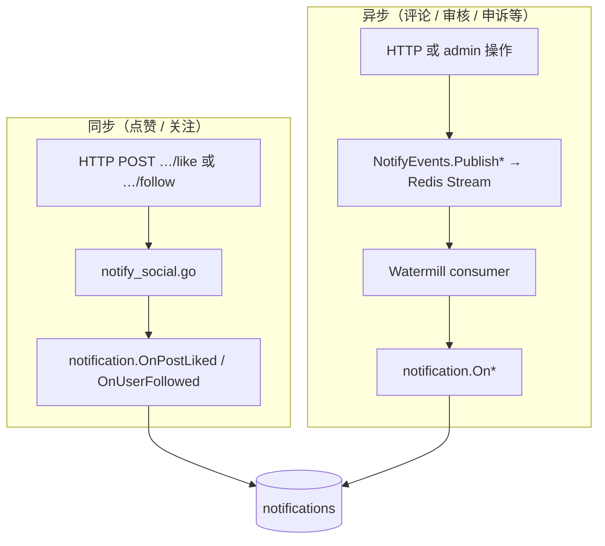
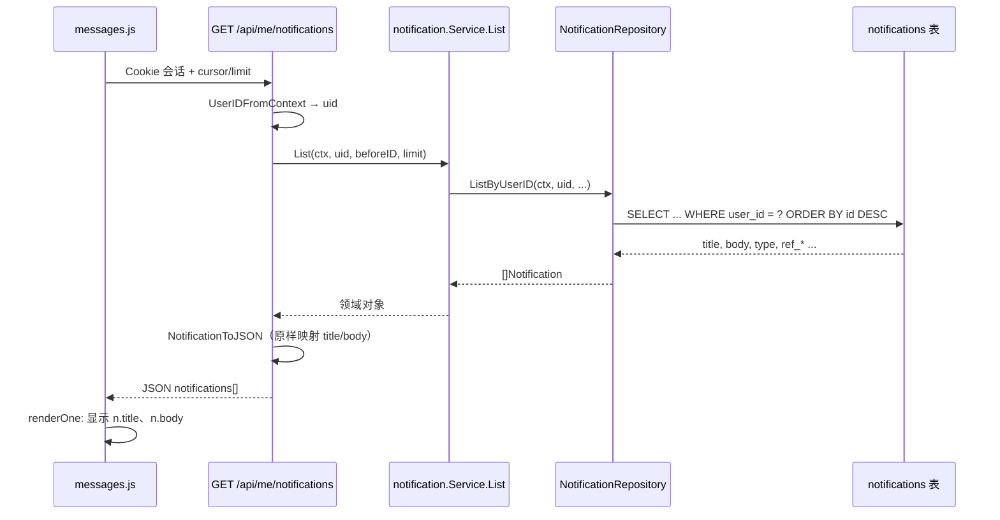

# 站内通知消息体：生成、存储与查询

本文说明 Blink **站内通知**（`notifications` 表）中 `title` / `body` 字段如何产生、如何落库，以及用户打开「消息」页时后端与前端如何**读出并展示**。

相关代码：

| 层级 | 路径 |
|------|------|
| 领域类型 | `domain/notification/notification.go` |
| 写消息体 | `application/notification/service.go` |
| 同步触发（点赞/关注） | `infrastructure/interface/http/api/notify_social.go` |
| 异步触发（评论/审核等） | `infrastructure/messaging/notification_watermill_*.go` |
| 持久化 | `infrastructure/persistence/gormdb/notification_repository.go` |
| HTTP 查询 | `infrastructure/interface/http/api/notifications.go` |
| Web 展示 | `web/assets/js/pages/messages.js` |

另见：[watermill-notifications.md](watermill-notifications.md)（异步事件）、[platform/db/SCHEMA.md](../platform/db/SCHEMA.md)（表结构）。

---

## 1. 核心结论（先读这段）

1. **消息体在「写入通知」时一次性生成**，存入 `notifications.title` 与 `notifications.body`（`TEXT`）。
2. **读取列表时不再查 `users` 表补全昵称**；API 原样返回库里的 `title` / `body`。
3. 涉及用户称呼时，写入阶段通过 `userDisplayName` 查 `users.name`：**有展示名用名字，否则用 `用户 {snowflake_id}`**。
4. **收件人**由业务方法决定（例如点赞通知的 `user_id` = 帖子作者，不是点赞者）。
5. 点赞/关注走 **HTTP 层同步写库**；评论/下架/申诉等多数走 **Watermill + Redis Stream 异步写库**，但最终都调用同一个 `notification.Service.send`。

---

## 2. 数据模型

### 2.1 表 `notifications`

定义见 `platform/db/0006_notifications_appeals.sql`：

| 列 | 说明 |
|----|------|
| `id` | 通知 ID（snowflake，应用生成） |
| `user_id` | **收件人** `users.snowflake_id` |
| `type` | 类型字符串，见 `domain/notification` 常量 |
| `title` | 标题（最长 500 字符，写入前截断） |
| `body` | **消息正文**（最长 8000 字符，写入前截断） |
| `ref_post_id` | 可选，关联帖子（前端「查看帖子」链接） |
| `ref_reply_id` | 可选，关联评论 |
| `read_at` | 已读时间；`NULL` 为未读 |
| `created_at` | 创建时间 |

索引：

- `idx_notifications_user_created`：按用户拉列表、按时间倒序
- `idx_notifications_user_unread`：未读计数

### 2.2 领域对象

```go
// domain/notification/notification.go
type Notification struct {
    ID, UserID int64
    Type, Title, Body string
    RefPostID, RefReplyID *int64
    ReadAt *time.Time
    CreatedAt time.Time
}
```

### 2.3 API JSON（查询响应）

```go
// infrastructure/interface/http/api/json.go — NotificationJSON
{
  "id": "2058...",
  "type": "post_liked",
  "title": "大A 给你的帖子点了赞",
  "body": "大A 给 一个大虾 的帖子点了赞。",
  "ref_post_id": "2046226...",
  "read": false,
  "created_at": "2026-05-24T14:20:00Z"
}
```

Snowflake 字段均带 `json:",string"`，避免浏览器精度丢失。

---

## 3. 消息体如何「拼出来」（写入阶段）

所有通知最终经 `application/notification/service.go` 的 `send` 落库：

```text
OnXxx(...)  →  组装 title/body  →  send(ctx, 收件人userID, type, title, body, refPost, refReply)
                                      →  Repo.Create → INSERT notifications
```

### 3.1 用户展示名：`userDisplayName`

写入前若需要提到某用户，调用：

```go
func (s *Service) userDisplayName(ctx context.Context, userID int64) string
```

逻辑：

| 条件 | 返回值 |
|------|--------|
| `userID == 0` | `"用户"` |
| `s.Users != nil` 且 `GetByID` 成功且 `name` 非空 | `strings.TrimSpace(u.Name)` |
| 其它 | `"用户 " + strconv.FormatInt(userID, 10)` |

依赖：`notification.Service.Users` 为 `domain/user.Repository`（运行时注入 `gormdb.UserRepository`），查询 `users` 表主键 `snowflake_id`。

**注意**：展示名只在**写通知的那一刻**解析；用户之后改名，历史通知正文不会变。

### 3.2 各类型 `title` / `body` 模板

| `type` | 收件人 | 标题示例 | 正文示例 |
|--------|--------|----------|----------|
| `post_liked` | 帖子作者 | `{点赞者名} 给你的帖子点了赞` | `{点赞者名} 给 {作者名} 的帖子点了赞。` |
| `user_followed` | 被关注者 | `{关注者名} 关注了你` | `{关注者名} 关注了你。` |
| `reply` | 楼主 | `{评论者名} 评论了你的帖子` | 同上 + `\n内容摘要：{snippet≤200}` |
| `reply_to_comment` | 父评论作者 | `{回复者名} 回复了你的评论` | 同上 + 摘要 |
| `post_removed` | 作者 | `帖子已下架` | 固定文案 + 可选原因 |
| `post_flagged` | 作者 | `帖子被标记违规` | 固定文案 + 说明 |
| `appeal_submitted_admin` | 各 `super_admin` | `待处理申诉/复核` | `{作者名} 对帖子 {id} 提交了…` |
| `sensitive_hit_admin` | 各 `super_admin` | `敏感词命中待处理` | 帖子 id + `{作者名}` + 命中词 |
| `appeal_result` | 作者 | `申诉/复核结果` | 通过/驳回 + 管理员说明 |
| `feedback_*` | 用户或管理员 | 见 `OnFeedback*` | 多为工单 id，管理员通知里仍可能用数字 id |

实现入口：`OnPostLiked`、`OnUserFollowed`、`OnNewReply` 等，均在 `application/notification/service.go`。

### 3.3 示例：a@a.com 点赞 demo@example.com 的帖子

用户表（示例）：

| email | snowflake_id | name |
|-------|----------------|------|
| a@a.com | `2043347896367058944` | 大A |
| demo@example.com | `2041005334952153088` | 一个大虾 |

流程：

1. a 登录，`POST /api/posts/{postId}/like`。
2. `postlike.Service.Like` 写入 `post_likes`。
3. `httpapi.Server.notifyPostLiked(postId, likerID)`（`notify_social.go`）。
4. `Posts.GetByID` 得到 `post.UserID` = demo 的 id；若 `likerID == post.UserID` 则**不发通知**。
5. `Notifications.OnPostLiked(ctx, postAuthorID, postID, likerID)`：
   - `likerName` ← `userDisplayName(likerID)` → `"大A"`
   - `authorName` ← `userDisplayName(postAuthorID)` → `"一个大虾"`
   - `title` = `"大A 给你的帖子点了赞"`
   - `body` = `"大A 给 一个大虾 的帖子点了赞。"`
   - `user_id` = demo 的 snowflake_id
6. `INSERT INTO notifications (...)`。

收件人是 **demo**，不是 a。用 a 的账号打开消息页看不到这条通知。

---

## 4. 谁触发写入：同步 vs 异步



| 场景 | 触发位置 | 写库方式 |
|------|----------|----------|
| 点赞 | `likes.go` → `notifyPostLiked` | **同步**，`context.Background()` |
| 关注 | `follow.go` → `notifyUserFollowed` | **同步** |
| 评论 | `replies.go` → `PublishReplyToPost` | **异步**，消费者调 `OnNewReply` |
| 意见反馈 | `application/feedback/service.go` | **同步** 调 `OnFeedback*` |
| 管理员下架/申诉 | `application/admin` + 事件 | 多为 **异步** |

点赞/关注使用 `context.Background()`，避免 HTTP 请求结束后 context 取消导致写库失败。

---

## 5. 查询消息体（读取阶段）

用户打开 `/web/messages.html` 时，**不会重新拼正文**，只读已存储字段。

### 5.1 端到端时序



### 5.2 HTTP 接口

| 方法 | 路径 | 作用 |
|------|------|------|
| GET | `/api/me/notifications?limit=30&cursor={id}` | 分页列表（cursor 为上一页最后一条 `id`） |
| GET | `/api/me/notifications/unread_count` | 未读数 |
| POST | `/api/me/notifications/{id}/read` | 单条已读 |
| POST | `/api/me/notifications/read_all` | 全部已读 |

均需登录（`RequireSession` + `RequireActiveUser`）。

Handler：`infrastructure/interface/http/api/notifications.go` → `ListNotifications`。

### 5.3 Repository 查询 SQL 语义

`NotificationRepository.ListByUserID`（`notification_repository.go`）：

```sql
SELECT * FROM notifications
WHERE user_id = ?
  AND (id < ?)   -- 仅当 cursor 存在
ORDER BY id DESC
LIMIT ?
```

- 默认 `limit`：请求未传时 HTTP 层默认 30；Repository 上限 100。
- **不按 `type` 过滤**；**不 JOIN `users`**。
- 返回的 `title`、`body` 即为写入时的快照。

### 5.4 JSON 映射规则

`NotificationToJSON`：

| DB / 领域 | JSON |
|-----------|------|
| `Title` | `title` |
| `Body` | `body` |
| `ReadAt != nil` | `read: true` |
| `CreatedAt` | `created_at`（UTC RFC3339） |
| `RefPostID` | `ref_post_id`（字符串） |

**查询阶段不会**调用 `userDisplayName`。

### 5.5 前端展示

`web/assets/js/pages/messages.js`：

- `loader` → `GET /api/me/notifications`
- `renderOne(n)`：
  - 标题：`n.title`
  - 正文：`n.body`（`white-space: pre-wrap`，保留换行）
  - 元信息：`n.type` + 本地化时间
  - 若 `ref_post_id` 存在 → 链接 `/web/post.html?id=...`
  - 未读样式：`read === false` → CSS class `unread`

前端**不解析**消息体里的用户名，也不二次请求用户资料接口。

---

## 6. 用 SQL 直接查消息体（运维 / 排查）

```sql
-- 某用户最近通知（含正文）
SELECT id, type, title, body, ref_post_id, read_at, created_at
FROM notifications
WHERE user_id = 2041005334952153088  -- demo@example.com
ORDER BY created_at DESC
LIMIT 20;

-- 某帖相关点赞通知
SELECT n.*, u.email
FROM notifications n
JOIN users u ON u.snowflake_id = n.user_id
WHERE n.type = 'post_liked' AND n.ref_post_id = 2046226592258068480;
```

第二条 JOIN 仅用于排查收件人邮箱；**应用读接口不做此 JOIN**。

---

## 7. 常见问题

### 7.1 点赞了但对方没消息

1. **看错账号**：通知在**帖子作者**账号下，不在点赞者账号下。
2. **已赞过**：再次点赞返回 `409 already liked`，不会第二次写通知；需先取消赞再赞。
3. **给自己点赞**：`post.UserID == likerID` 时跳过通知。
4. **服务未重启**：需运行包含 `notify_social.go` 同步逻辑的构建。
5. **查库确认**：`SELECT * FROM notifications WHERE user_id = {作者id} AND type = 'post_liked' ORDER BY created_at DESC;`

### 7.2 消息里仍是数字 id 而不是名字

- 旧数据：修复展示名逻辑之前写入的通知不会自动更新。
- `users.name` 为空：会回落为 `用户 {id}`。
- `notification.Service.Users` 未注入：理论上不应发生在当前 `cmd/main.go`（已注入 `userRepo`）。

### 7.3 改名后消息没变

符合设计：正文为写入时快照。若需「始终显示最新昵称」，需改为读取时 JOIN `users`（当前未实现）。

---

## 8. 扩展阅读

- 异步事件字段：`docs/watermill-notifications.md`
- 社交 API：`docs/social-feed-and-admin.md`
- curl 示例：`docs/http-curl-examples.md`（通知列表在登录小节之后可自行补充调用）
